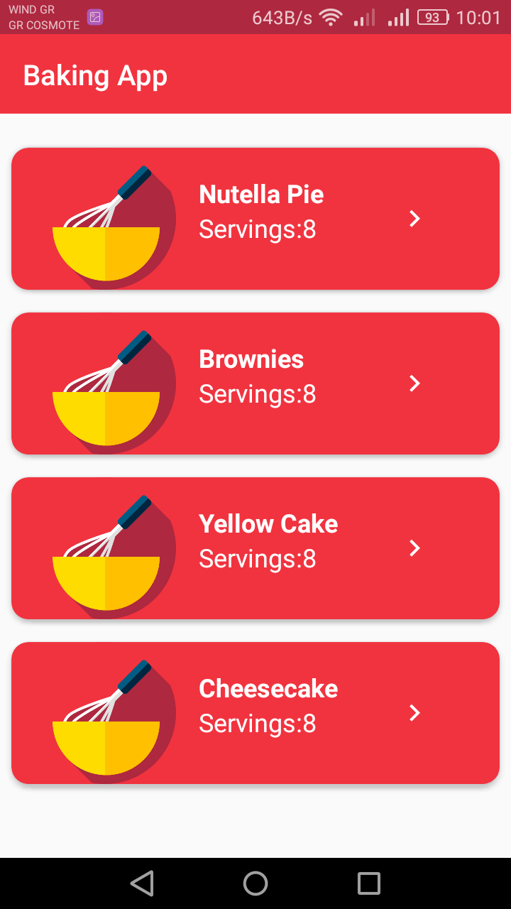
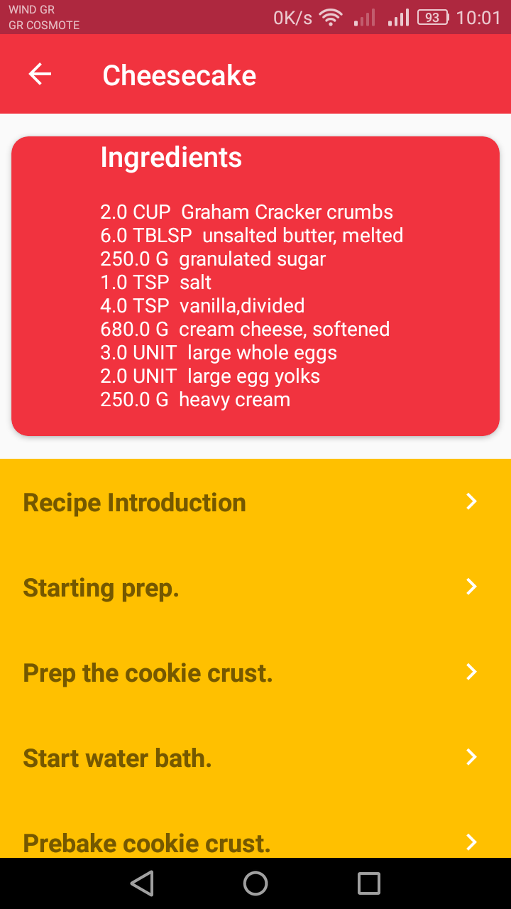
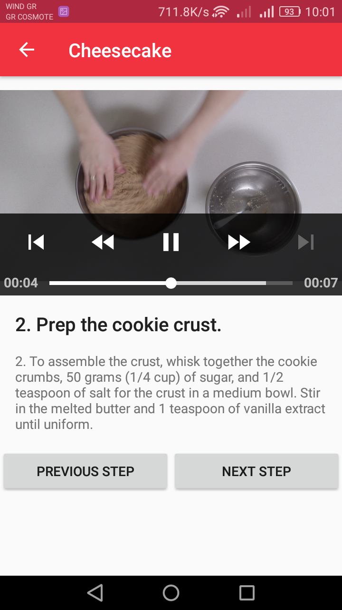
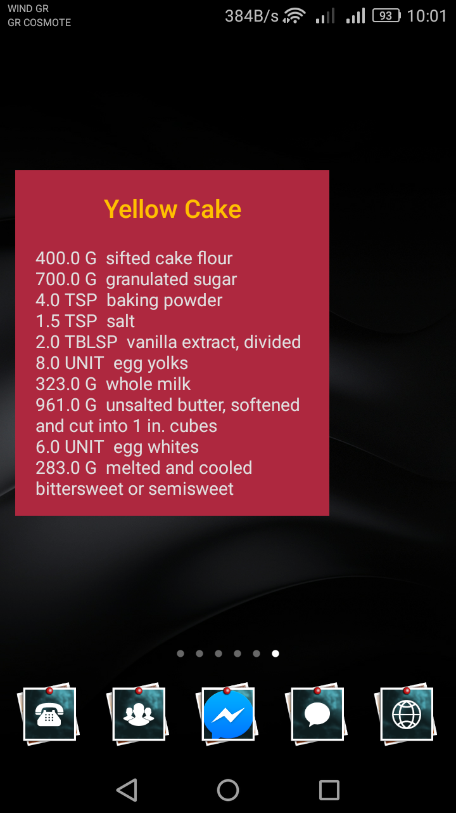
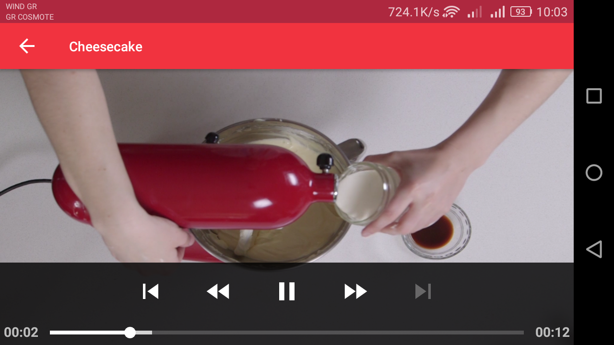
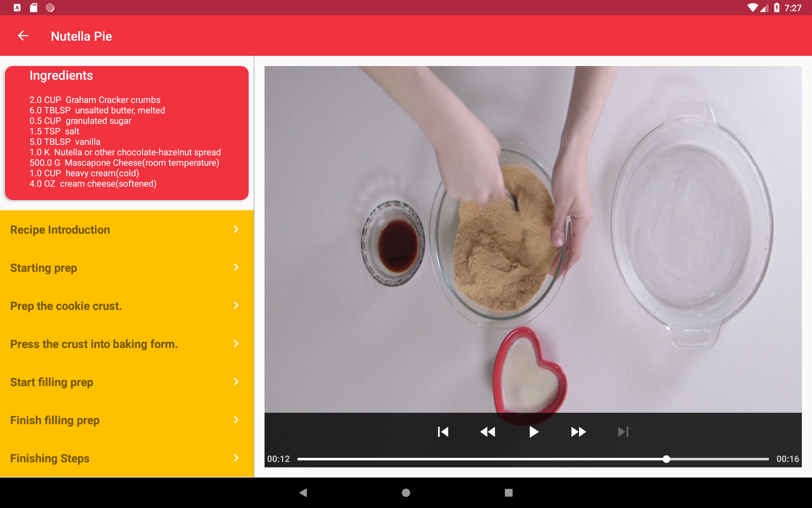
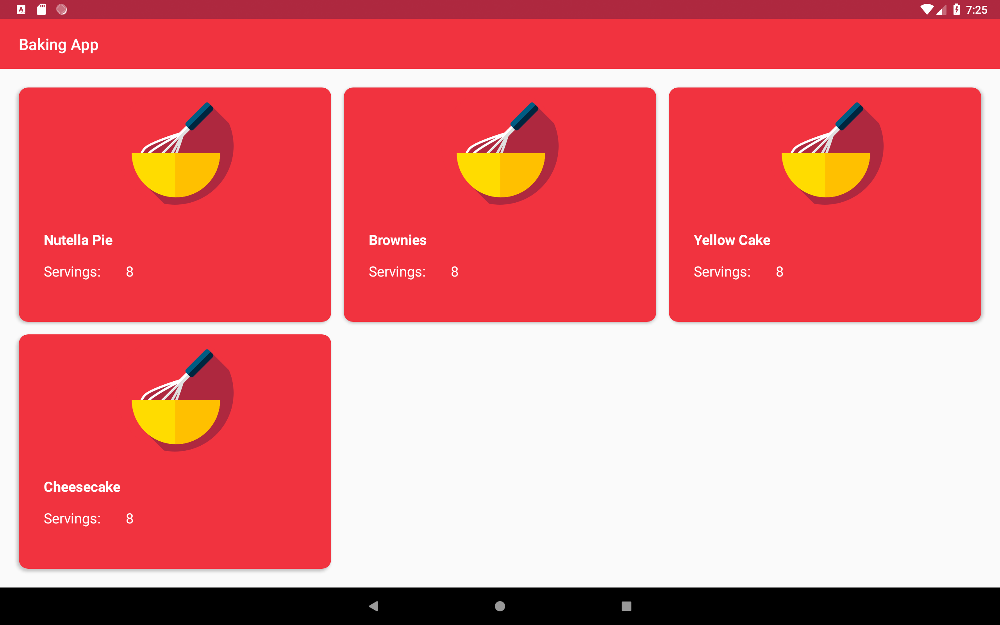
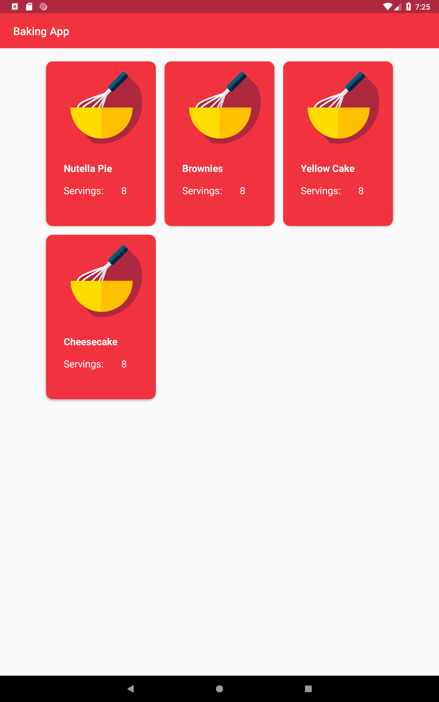

# Baking App
Baking App is an app for Udacity’s resident baker-in-chief, Miriam, to share her recipes with the world. The user can select a recipe and 
see video-guided steps for how to complete it.

It is a project during Udacity's Android Developer Nanodegree Program.

Through this project I learnt to:
<ul>
  <li>use MediaPlayer/Exoplayer to display videos.</li>
  <li>handle error cases in Android.</li>
  <li>handle unexpected input in my data</li>
  <li>add a widget to my app experience.</li>
  <li>leverage a third-party library in myr app.</li>
  <li>use Fragments to create a responsive design that works on phones and tablets.</li>
</ul>

The recipe listing (the JSON file which contains the recipes' instructions, ingredients, videos and images) is located here: https://d17h27t6h515a5.cloudfront.net/topher/2017/May/59121517_baking/baking.json.

And some sample mocks are located here: https://d17h27t6h515a5.cloudfront.net/topher/2017/March/58dee986_bakingapp-mocks/bakingapp-mocks.pdf

<h2> App's screenshots</h2>

   

   

   

 

 

 

